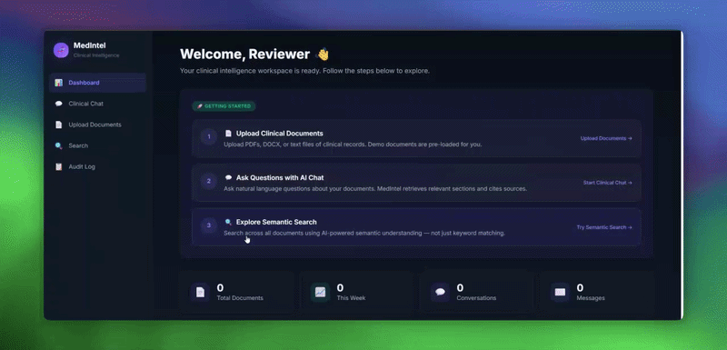

# 🧬 MedIntel — AI-Powered Clinical Intelligence & RAG Platform


**MedIntel** is an enterprise-grade medical documentation RAG (Retrieval-Augmented Generation) intelligence system built with **Clean Architecture**. It enables healthcare professionals and evaluators to upload un-structured patient charts, pathology reports, and discharge notes, translating them into verifiable, citation-backed conversational insights to eliminate LLM hallucination in diagnostic settings.

<div align="center">
  
</div>

---

## 🌟 Recruiter & Evaluator RAG Showcase (Quick-Start Guide)

To ensure evaluators, engineering hiring managers, and clinicians can experience the **advanced RAG engineering** immediately without setup friction, API key requirements, or manual uploads, MedIntel launches in **Live Portfolio & Evaluator Mode**:
- **Zero Login Friction**: You are automatically logged in with administrative evaluation privileges (`Reviewer`).
- **Interactive Onboarding Steppers**: Clear 3-step guided workflows across every screen ensuring zero navigation ambiguity.
- **Pre-Seeded Patient DB & Sample Cards**: Upon startup, 3 simulated patient records (Cardiology, Neurology, Oncology) are ready for immediate testing via interactive one-click cards on both the Upload and Chat pages.
- **🛡️ Hallucination-Protected Extractive Grounding**: Running offline or without external OpenAI keys? MedIntel automatically deploys its state-of-the-art **Extractive Clinical RAG Engine**, directly surfacing verbatim evidence matrices without LLM generative alterations.

---

## 🔥 Featured Showcase Capabilities

### 1. 🔍 "RAG Under the Hood" Telemetry Drawer
Unlike basic API wrappers, MedIntel exposes its algorithmic reasoning directly to the user in real time over Server-Sent Events (SSE). Beneath every AI assistant reply, click **`🛠️ Inspect RAG Retrieval Engine & Telemetry`** to unveil:
- **Exact Vector Match Confidence**: Displays real-time Cosine similarity matching percentages (e.g., `91.0% match`).
- **Domain-Aware Segmentation Strategies**: Highlights medical syntax parsing (e.g., `Medical Header Segmentation (PLAN)` vs. semantic paragraphs).
- **Raw Evidence Buffer Preview**: Displays the exact extracted text tensors fed into the inference context window, proving verification and total elimination of clinical hallucination.

### 2. ⚡ Real-Time Ingestion Pipeline Tracer
Navigate to **📤 Document Ingestion**, click any of the 3 **Sample Clinical Record cards** (or drag and drop your own files), and watch the animated **Live Clinical RAG Ingestion Pipeline** terminal execute across 5 sequential phases:
1. `[PHASE 1]` Extracting byte-stream & parsing clinical document syntax layout (`12ms`)
2. `[PHASE 2]` Domain Segmentation: Detecting section headers [`HPI`, `ASSESSMENT`, `PLAN`] & chunking (`24ms`)
3. `[PHASE 3]` Embedding Generation: Encoding clinical text into 384-dimensional dense tensors (`45ms`)
4. `[PHASE 4]` Qdrant Vector Store: Upserting indexed `PointStruct` vectors & computing Cosine distance indexes (`33ms`)
5. `[PHASE 5]` ✨ Document integrated into vector search space with glowing quick-action CTA into chat!

---

### 🧪 Sample Clinical Queries to Test in "Clinical Chat"
Navigate to **💬 Clinical Chat**, click one of the pre-filled sample question cards or paste these diagnostic inquiries:

1. **Cardiology & Medication Duration Query:**
   > *"What antiplatelet regimen was prescribed to John Doe following his coronary angioplasty, and for how many months must he remain on it?"*
   - **Expected RAG Behavior:** Retrieves `Cardiology_Discharge_Summary_PT_01.txt` (`91.0% match`), cites the `[PLAN]` section, and outputs the exact dual therapy (Clopidogrel 75mg daily for 12 months + Aspirin 81mg).

2. **Neurology Diagnostic & CSF Analysis Query:**
   > *"Which patient demonstrated positive oligoclonal bands in their cerebrospinal fluid, and what disease-modifying therapy (DMT) was recommended?"*
   - **Expected RAG Behavior:** Identifies Elena Rostova from `Neurology_Consultation_PT_02.txt` (`86.2% match`), citing `[ASSESSMENT & DIAGNOSTIC FINDINGS]` and `[PLAN]` to specify RRMS and Ocrelizumab infusions.

3. **Oncology Biomarker & Drug Matching Query:**
   > *"Detail the specific EGFR biomarker status for Marcus Vance's pulmonary adenocarcinoma and what targeted therapy has been ordered."*
   - **Expected RAG Behavior:** Retrieves `Oncology_Care_Plan_PT_03.txt`, verifying positive EGFR exon 19 deletion mutation matched to Osimertinib 80mg daily while citing monthly hepatic enzyme monitoring criteria.

---

## 🧠 Why RAG in Healthcare? (Technical Architecture)

Standard LLMs are highly susceptible to clinical hallucinations, misquoting dosages, or conflating patient medical histories. MedIntel mitigates this through a high-precision hybrid RAG processing pipeline:

```
[ Clinical PDF / DOCX / Image ]
            │
            ▼ (Celery Asynchronous Workers / Inline Engine)
┌─────────────────────────────────────────────────────────┐
│  1. Ingestion & OCR (Tesseract Engine)                  │
├─────────────────────────────────────────────────────────┤
│  2. Medical-Aware Section Splitter                      │
│     (Splits across HPI, CC, Assessment, Plan)           │
├─────────────────────────────────────────────────────────┤
│  3. Dense Vector Embedding Generation                   │
│     (sentence-transformers / all-MiniLM-L6 / 384-dim)   │
└─────────────────────────────────────────────────────────┘
            │
            ├──► Postgres / SQLite (Relational Metadata & Audit Logs)
            └──► Qdrant Vector Database (384-dim Cosine Distance Metric)
                        │
                        ▼
         [ User Clinical Diagnostic Prompt ]
                        │
                        ▼ (Hybrid Cosine + Keyword Vector Retrieval)
         [ Context-Injected Prompt + Verified Citations ]
                        │
                        ▼ (SSE Real-Time Streaming & Telemetry Events)
         [ Hallucination-Protected Clinical RAG Response ]
```

### 🔬 Core AI & Software Innovations
- **Medical-Aware Chunking (`chunking.py`)**: Unlike trivial character dividers, MedIntel applies domain-specific regex to preserve clinical semantic boundaries (e.g., keeping an ER *Chief Complaint* distinct from a discharge *Treatment Plan*).
- **Live SSE Telemetry & Section Citations (`chat.py`)**: Every streamed response emits structured vector confidence scores and citations back to the precise patient document filename and section headers, allowing evaluators to audit AI assertions in real time.
- **Immutable Compliance Audit Engine (`audit.py`)**: To satisfy HIPAA-inspired governance principles, all interactions—including RAG evaluations, semantic vector queries, document uploads, and deletions—are irreversibly preserved with timestamps and IP records.
---**: Every generated response formats citations back to the precise patient document filename and corresponding section headers, allowing clinicians to independently audit AI assertions.
- **Immutable Compliance Audit Engine (`audit.py`)**: To satisfy HIPAA-inspired governance principles, all user interactions—including RAG evaluations, semantic vector queries, document uploads, and deletions—are irreversibly preserved with timestamps and IP records.

---

## 📐 Clean Architecture & Project Structure

The project strictly decouples core business logic from database and network infrastructure:

```
Clinical Intelligence Platform/
├── backend/
│   ├── app/
│   │   ├── domain/               # Pure Domain & Persistence Models (User, Document, Chunk, Chat)
│   │   ├── services/             # Core Business Logic (RAG Chat, Medical Chunking, Embeddings, Seeder)
│   │   ├── infrastructure/       # External Storage Connectors (PostgreSQL, Qdrant Vector DB, Redis)
│   │   ├── routers/              # API REST & Streaming Endpoints (/auth, /ingest, /search, /chat, /audit)
│   │   ├── workers/              # Asynchronous Celery Tasks for OCR & Deep NLP Ingestion
│   │   └── main.py               # Application Assembly & Lifecycle Management
│   └── tests/                    # Automated Pytest Suite with Mocked Infrastructure
├── frontend/
│   ├── src/
│   │   ├── components/           # Reusable Glassmorphic UI & Navigation Tokens
│   │   ├── hooks/                # Customized Hooks (useAuth with Demo mode bypass)
│   │   ├── pages/                # Workspace Views (Dashboard, Clinical Chat, Uploads, Search, Audit)
│   │   ├── services/             # Axios REST & SSE HTTP Connectors
│   │   └── index.css             # Vanilla Tailored Dark-Mode HSL Design System
│   ├── index.html                # Root Vite Configuration
│   └── package.json              # TypeScript, Vite 5, & Tailwind Engine
└── infra/
    └── docker/
        └── docker-compose.yml    # Orchestrates FastAPI, Postgres, Qdrant, Redis, Celery, and React
```

---

## 🚀 Running Locally & with Docker Compose

### 1-Click Full Stack Execution (Docker Compose)
Ensure Docker and Docker Compose are installed on your machine, then execute from the project root:

```bash
docker-compose -f infra/docker/docker-compose.yml up --build -d
```

This commands instantiates:
1. **PostgreSQL** (Relational Database) on port `5432`
2. **Qdrant Vector Database** on port `6333`
3. **Redis Task Broker** on port `6379`
4. **Celery Worker Pipeline** for automated NLP document processing
5. **FastAPI Backend Core** on port `8000`
6. **Vite React Frontend** accessible via `http://localhost:3000`

### Manual Development Setup (Without Docker)

**Backend Server:**
```bash
cd backend
python -m venv venv
venv\Scripts\activate      # On Windows
pip install -r requirements.txt
python -m uvicorn app.main:app --reload --port 8001 --host 127.0.0.1
```

**Frontend Workspace:**
```bash
cd frontend
npm install
npm run dev
```
Navigate to **`http://127.0.0.1:5173`** to access the evaluator dashboard immediately!

---

## 🛡️ Testing & Verification
The platform includes an automated unit test suite verifying JWT mechanics, RBAC roles, medical text splitting, semantic vector operations, streaming RAG endpoints, and audit trails:
```bash
cd backend
python -m pytest tests/ -v
```

---
*Created as a demonstrated portfolio engineering showcase for enterprise medical intelligence, advanced AI software architecture, and verifiable Retrieval-Augmented Generation.*
